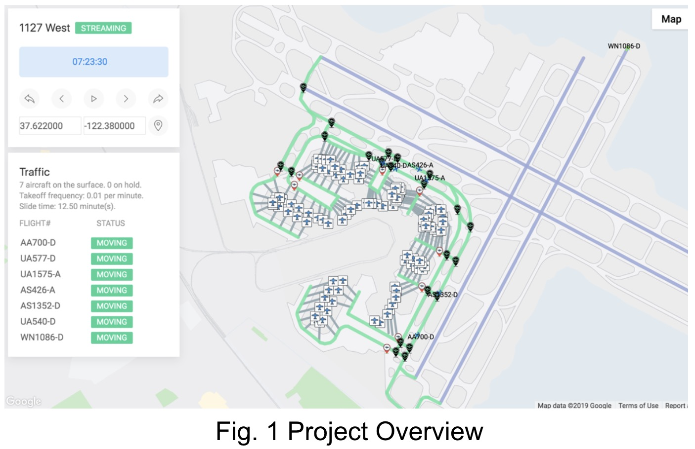
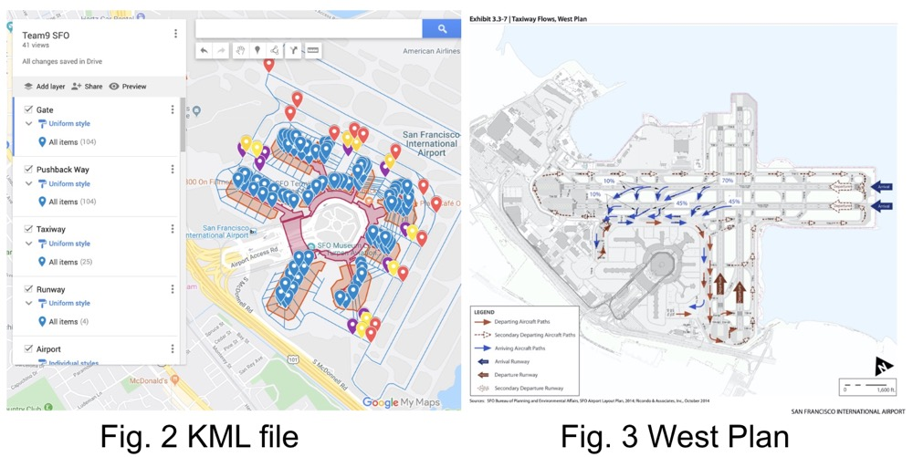

# ASSET2 - Airport Surface Simulator and Evaluation Tool 2

[](https://travis-ci.com/nasa-airport/airport-simulation)



##### Be careful: the latest version has conflicts, you can try '798aa10615d217dcdf843dda8d0c5cc251e65dc8' on Dec 3, 2019.

## About

ASSET2 is a generic airport simulation tool for research purpose. It is designed to support multiple airports, to test and to evaluate customized schedulers. Please check out [our paper](https://drive.google.com/file/d/0B8ck8iyI0dnfSEtUSDl3SjBiYXgwdXpOWERvaWMzZ1NtV3A0/view?usp=sharing) for more information.

> This tool is built for Carnegie Mellon University MSIT Practicum Project and Master Independent Study sponsored by the NASA Ames Research Center.


## How to Run

> **Please note that the code runs in Python 3.** 
>
> **Please avoid Python>=3.7.0** because it breaks the legacy Cython, which one of the dependencies line-profiler (test package) depends on. The issue has not been [fixed](https://github.com/rkern/line_profiler/issues) at the moment. Try to install a lower version instead.

### First-Time Installation
**If you're on Ubuntu:**

```sh
$ sudo apt-get update
$ sudo apt-get install -y python3-pip
$ mkdir -p ~/.config/matplotlib/
$ echo "backend : Agg" >> ~/.config/matplotlib/matplotlibrc
```

**Set-up Virtual Environment (highly recommended):**

 - If you are using IntelliJ or any other JetBrain IDE, see [this link](https://www.jetbrains.com/help/idea/creating-virtual-environment.html) (recommended).

 - If you are using commend line:
 
    ```sh
    $ {path/to/python3} -m venv venv # create a new virtual environment
    $ source venv/bin/activate # activate the virtual environment
    $ pip install -r requirements.txt # install dependencies locally
    $ python simulator.py -f plans/base.yaml # execute the simulation
    ```

**Install dependencies:**

```sh
$ pip install -r requirements.txt
```

### Prepare Airport Map

Place airport related data (kml file) under `data` folder like `data/sfo-terminal-2/build/` (use IATA airport code).

Now we build the whole sfo map on Google map:
https://drive.google.com/open?id=1wUbdfLDRcGiitjo_h5ar-xlAO7OmdVOg&usp=sharing

If you need to change it, export one kml file and change codes at 'data/*/build/generate.py', especially 'class LayerType(Enum)'

We design taxiways in the map following west plan that let all departure
 airlines share same
 and fixed taxiways and all arrival airlines share the same and fixed
  taxiways. (shortest path algorithm)
 


### Prepare Airline Data

We use the web crawler to get real sfo data from www.flysfo.com.

'data/*/build/generate_scenario.py' and 'data/*/build/time_manage.py' are both used to handle real data.

### Run
1. import the kml file to 'data/*/build/'
2. create one ymal file for it under 'plans/*.yaml'
3. run "python3.6 visualization/server.py"
4. after opening the link, all yaml files under 'plans/' will be shown on the menu. You can choose one. Maybe it needs several minutes to show new data unless you already have cache.

### Quick start (use stream mode)
```sh
python visualization/server.py
In the web page, select sfo-all-terminals as the data, and then you can see the simulation right away.
```
Besides that, you can also use batch mode according to the following.

### batch mode
```sh
$ python simulator.py -f plans/base.yaml
$ python simulator.py -f batch_plans/simple-uc.yaml # Batch Run
```
batch mode is used to run cached data. You may need it because our system
 will be slow after running two hours.

### Visualization
```sh
$ python visualization/server.py
```

### Tests
```sh
$ python -m unittest discover tests    # all tests
$ python -m unittest tests/test_scheduler.py   # single test
```

### Check Style
```sh
$ pycodestyle --show-pep8 --show-source --exclude=venv .
$ ls -1 *py scheduler/*py | xargs pylint # optional but recommended
```

### Documentation
```sh
$ pydoc <python-file-name-without-.py>
```

## Developer Guidelines

### Sequential Diagram


### Experiment Flow

The following steps are suggested for lauching an successful experiment
systematically.

1. Compose and launch a single plan to find out (a) the upper bound of the
   value of the experimental variable and (b) the execution time for a single
   run.

    ```
    $ time ./simulator.py -f plans/<upper-bound-to-try>.yaml
    ```

2. Use the visualization tool on the single plans you launched in step one to
   see if things are working as expected. For example, you should check if the
   aircrafts are busy enough in order to retrieve a meaningful plot.

   ```
    $ ./visualiztion/server.py
   ```

3. By using the execution time and upper bound information we collected from
   the previous steps we can then lanuch a batch run with
   `try_until_success: False`. The execution time of this batch run should be
   able to estimated.

4. By using the execution time and failure rate information from the previous
   steps, we can then launch a batch run with `try_until_success: True` to
   obtain meaningful final results.

### Style

Please ALWAYS follow [PEP 8 -- Style Guide for Python Code](https://www.python.org/dev/peps/pep-0008/) for readability and consistency.

### Logging

Default logging level is set in `simulation.py`, and please initialize logging
for each class in `__init__` like this way:

    self.logger = logging.getLogger(__name__)

### Debug

Put breakpoint in this way:

    import pdb; pdb.set_trace()

Also, please refer to our [Google Map](https://drive.google.com/open?id=1votbJbKKRUF5gDumno4GXOxVLAE&usp=sharing) for debugging the details.

### Units

For consistency, following units are used everywhere in the code:

    Time: second
    Length: ft

### Cache

Routing table calculated by the routing expert will be cached at `cache/` so
please make sure all the objects in routing table can be dumped into binary
file using `pickle`. Ex. logger can't be dumped.

Note that cache may cause errors or bugs in many cases because stale data is used.

### Clock

Simulation time (`sim_time`) indicates the time should be passed in each
`tick()` and it can be accessed globally in any place by using following
syntax:

    from clock import Clock
    self.logger.debug("sim time is %s", Clock.sim_time)

### Profile

To speedup the simulation, we can apply some profiling technique to locate the
slow code. Add `@profile` decorator at the beginning of the function you want to
profile, then do following commands to obtain a report of the execution time of
each line within the function.

    $ kernprof -l ./simulator -f <your_plan>.yaml
    $ python3 -m line_profiler simulator.py.lprof
